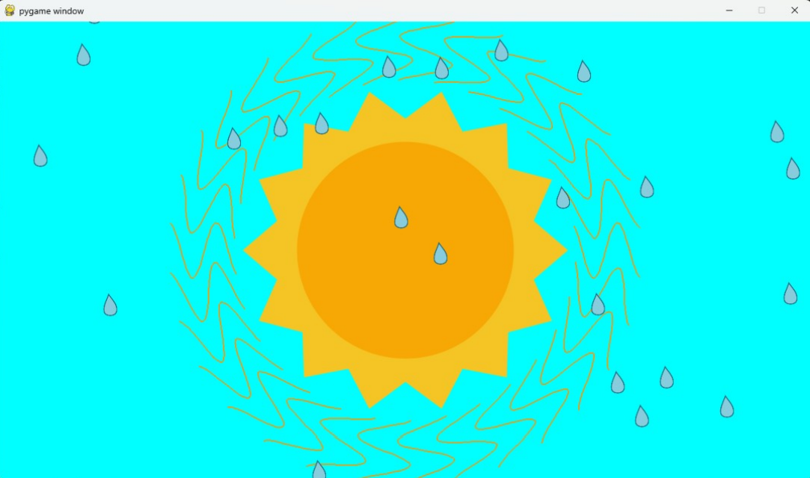
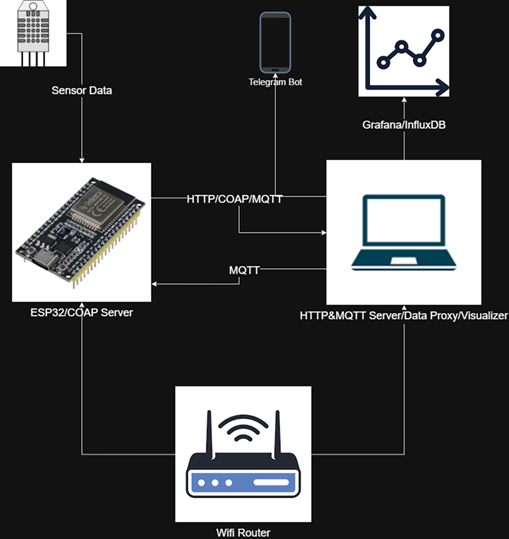
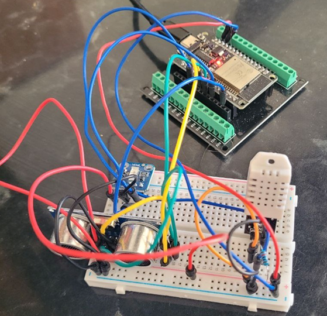

# Smart Weather Monitoring IoT System

A full-stack IoT system that monitors indoor environmental conditions (temperature, humidity, light, and motion) and transforms the data into real-time animated visuals, time-series dashboards, and short-term forecasts.

---

## Demo




---

## Features

- Real-time sensor data collection via ESP32 (ESP-IDF, FreeRTOS)
- Multi-protocol communication: HTTP, CoAP, and MQTT
- Animated Pygame visualizer — rain, heatwaves, sun/moon based on live sensor values
- Time-series storage in InfluxDB with Grafana dashboards
- Short-term forecasting (15 minutes ahead) using Facebook Prophet

---

## Architecture




The system has four main components:

1. **ESP32 Firmware** — reads sensors and transmits data via HTTP or CoAP; configurable over MQTT
2. **Data Proxy** — Python/Flask server that receives sensor data and writes it to InfluxDB
3. **Visualizer** — Pygame-based animated display running in a separate thread
4. **Forecast** — standalone Prophet script for predicting future conditions from InfluxDB CSV exports

---

## Hardware

| Component | Role |
|---|---|
| ESP32-WROOM-32 | Main microcontroller with Wi-Fi |
| DHT22 | Temperature and humidity sensing |
| VEML7700 | Ambient light sensing (I²C, lux readings) |
| HC-SR04 | Motion detection via ultrasonic distance measurement |




---

## Software Stack

**Firmware:** C (ESP-IDF), FreeRTOS, libcoap, mqtt_client, http_client

**Backend / Data Proxy:** Python, Flask, paho-mqtt, aiocoap, influxdb-client, Mosquitto (local MQTT broker)

**Visualization:** Python, Pygame

**Dashboards:** InfluxDB, Grafana

**Forecasting:** Python, Prophet, pandas, matplotlib

---

## How It Works

### ESP32 Firmware
Each sensor runs as a dedicated FreeRTOS task. The ESP32 connects to Wi-Fi and posts sensor readings to the data proxy using HTTP by default. It subscribes to three MQTT topics for runtime reconfiguration:

- `esp32/protocol` — switch between HTTP and CoAP
- `esp32/sampling_rate` — adjust the data reporting interval
- `esp32/motion_alert` — publish motion detection events

### Data Proxy
A Flask server handles incoming HTTP POST requests. CoAP is supported via aiocoap. An MQTT client (Mosquitto) handles reconfiguration commands and subscribes to motion alerts. All readings are forwarded to InfluxDB.

### Visualizer
Runs in a parallel Python thread alongside the data proxy. Sensor values drive visual effects:

- **Light** → background brightness (smoothed over last 10 samples)
- **Humidity** → number of animated raindrops on screen
- **Temperature** → amplitude and length of heatwaves around the sun/moon
- **Motion** → shifts the sun/moon position left or right, simulating wind

The sun or moon is displayed based on the current time of day.

### Forecast
A separate script loads historical data exported from InfluxDB as CSV and uses Facebook Prophet to predict temperature, humidity, and light levels 15 minutes into the future.

## Setup

### ESP32
1. Install [ESP-IDF](https://docs.espressif.com/projects/esp-idf/en/latest/)
2. Configure Wi-Fi credentials:
   ```
   idf.py menuconfig
   ```
3. Flash the firmware:
   ```
   idf.py build flash monitor
   ```

### Python (Data Proxy + Visualizer)
1. Install dependencies:
   ```
   pip install flask paho-mqtt aiocoap influxdb-client pygame prophet pandas matplotlib
   ```
2. Start Mosquitto MQTT broker locally
3. Run the main program:
   ```
   python data_proxy.py
   ```

### Forecasting
```
python forecast/forecast.py
```

---

## Author

**Alireza Vakilian Zand**  
Master's student in Electronics Engineering for IoT Systems  
Università di Bologna  
vakilian.alireza@gmail.com
